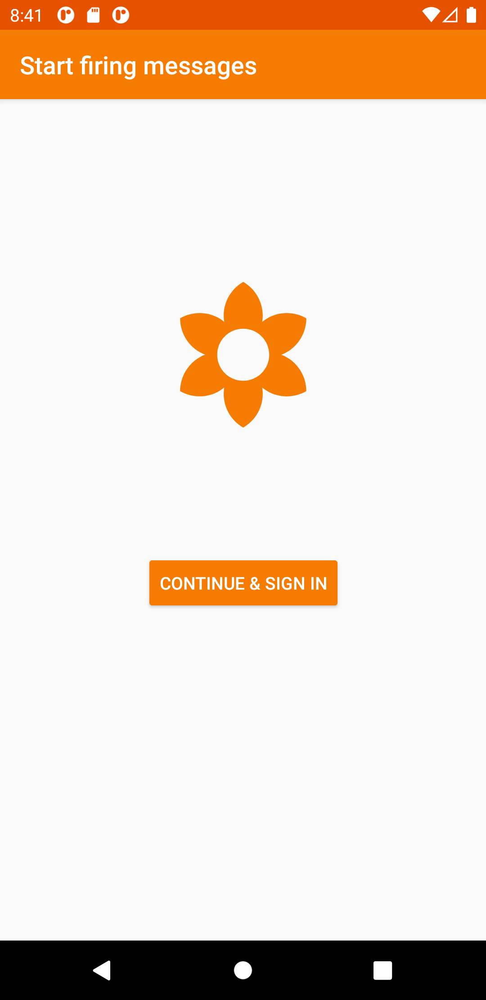
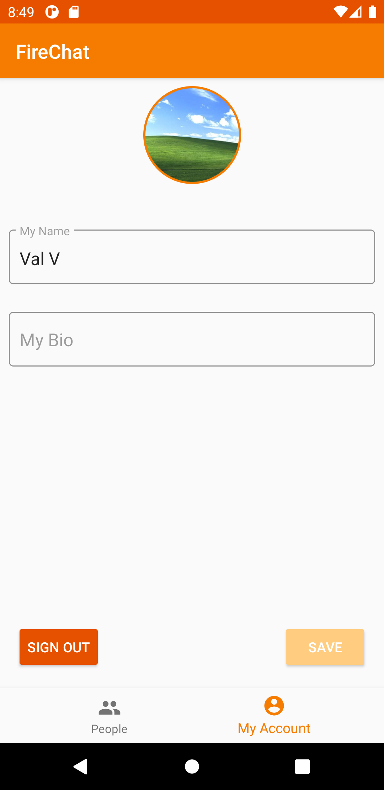
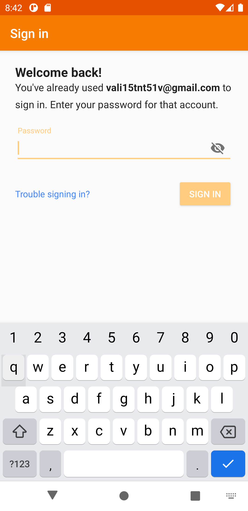
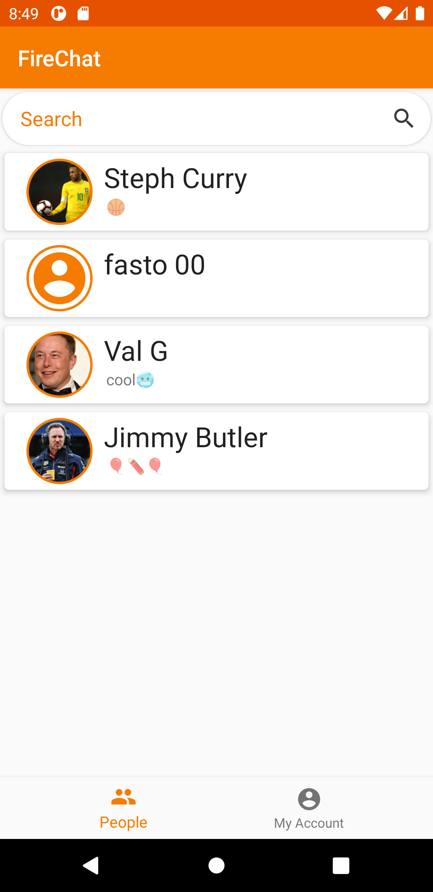

# FireChat
Android chat application using Kotlin and Firebase.

Based on the tutorial series from [Reso Coder's Firebase Firestore Chat App](https://www.youtube.com/watch?v=uB7WeED1d1w&list=PLB6lc7nQ1n4h5tzT3tu_YSy9VNrVUR_4W)

Main goal of the project was to learn a bit of Kotlin as mostly I've been working with Swift for developing iOS applications.

# Screenshots

Currently supported features and TODOs:

- [x] Firebase email login
- [x] Exchanging messages with other registered/authenticated users
- [x] Filter users based on their name
- [x] Fragment to edit the main information of a user
- [x] Upload and exchange images with others
- [ ] End-to-end encryption (a. only one device involved and b. multiple devices involved)
- [ ] Maybe redo email sign in to use a custom UI instead of the FirebaseAuthUI
- [ ] Create user groups based on interests etc. and filter based on these
